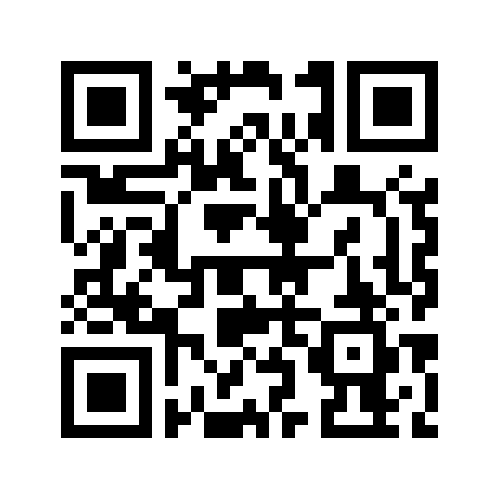

# Reciclar.IA
Este projeto foi desenvolvido no Climathon São Paulo 2024 com o objetivo de facilitar a identificação e correto descarte de resíduos no município de São Paulo, através do reconhecimento de imagens por inteligência artificial.

## Como utilizar

Envie uma mensagem pelo WhatsApp para o número +551150397887
